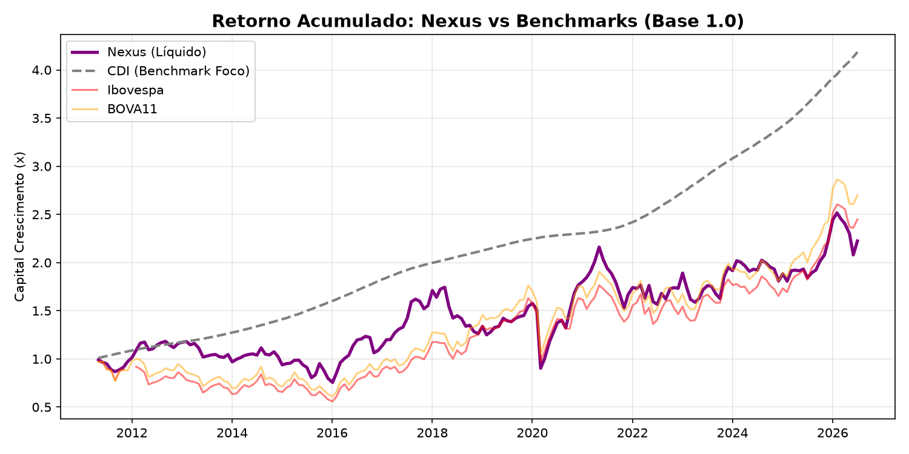
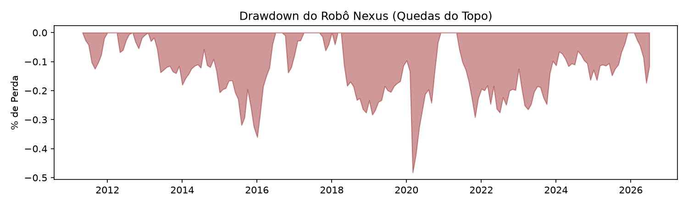
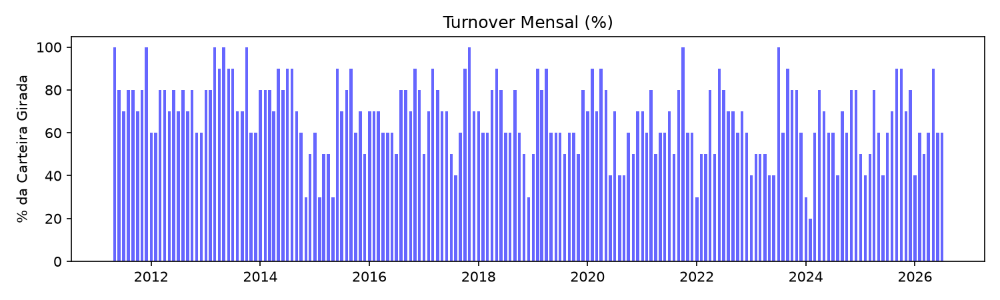

# Resumo do Backtest MVP - Robô Nexus

**Data de aprovação do relatório:** Automática (Final do Teste Cego)
**Métrica Vencedora Oficial:** Farness (Soma Absoluta das Distâncias)

## 1. Parâmetros Ativos
- **Janela de Correlação (Shrinkage):** 63 dias
- **Tamanho da Carteira:** Top 10 ações da periferia
- **Custo de Transação Escorregadio (B3 + Corretagem):** 0.05% por perna
- **Pesos:** Equal-weight (Transparência absoluta, sem fit de variância/Sharpe nulo)
- **Filtro de Regime:** DESLIGADO neste MVP (Teste limpo apenas com a seleção topológica)

## 2. Gráficos Visuais de Desempenho

### 📈 Retorno Acumulado (Curva de Capital)

> **Contexto para a Banca:** O Ibovespa no período rendeu *menos* que o CDI puro. Nosso benchmark e obstáculo central sempre será superar o dinheiro 100% livre de risco de crédito (CDI).

### 📉 Drawdown (As dores da Carteira)

### 🔄 Estabilidade (Giro Mensal)

> **Turnover médio mensal:** 67.4% 
*(Isso significa que o robô muda aproximadamente 6.7 ações por mês, segurando posições por mais de um semestre. Uma prova que a MST é estável no longo prazo).*

## 3. Tabela de Métricas Finais

| Métrica | Nexus (Líquido) | CDI | Ibovespa | BOVA11 |
|---|---|---|---|---|
| **Ret. Acumulado 15 anos** | 122.4% | 318.5% | 144.9% | 169.9% |
| **Rentabilidade Anualizada** | 5.4% | 9.8% | 6.0% | 6.7% |
| **Volatilidade Anual** | 21.7% | 1.0% | 22.0% | 22.0% |
| **Sharpe Ratio Clássico** | **-0.21** | N/A | -0.17 | -0.14 |
| **Máximo Drawdown** | -48.2% | 0.0% | -42.4% | -40.3% |
| **Calmar Ratio** | 0.11 | N/A | 0.14 | 0.17 |

> ⚠️ **ALERTA CRÍTICO:** O Sharpe do Nexus ficou **NEGATIVO**! A carteira perdeu do CDI de forma humilhante considerando o risco. Isso mostra a fragilidade do modelo puro, e **prova** que a Pessoa 2 (Filtro de Regime) será nossa verdadeira salvadora, defendendo a carteira com o CDI quando a árvore encolher.
> ⚠️ **ALERTA DE GIRO:** Turnover acima de 60%! Os lucros estão virando pó na mão da B3 e da corretora.