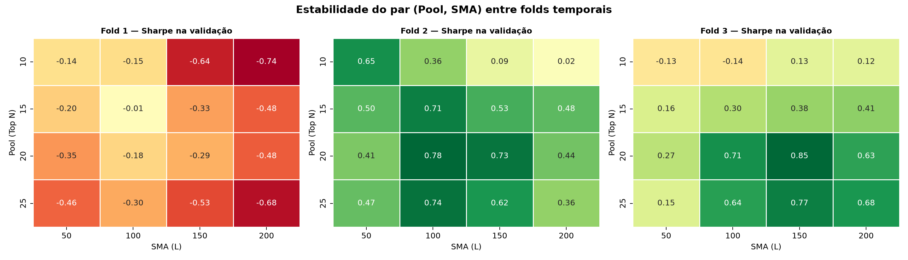

# Calibração Temporal do Filtro de Momentum (TICKET-C04)

**Script:** `scripts/18_cv_temporal.py`
**Substitui:** a tabela anterior deste arquivo, que não era gerada por nenhum script
e cujos números não fechavam com o total in-sample.

---

## 1. Desenho da validação

O filtro de momentum não tem parâmetros ajustados por otimização — é uma regra
binária (preço > SMA). "Treinar" aqui significa apenas **escolher** o par
(Pool, SMA). A pergunta que a validação cruzada responde é de **estabilidade**:

> O par vencedor é o mesmo em todos os folds, ou muda conforme o sub-período?

Folds com janela expansível, conforme a Parte 3.1.1 do plano-mestre:

| Fold | Treino | Validação |
|---|---|---|
| Fold 1 | 2011–2014 | 2015–2016 |
| Fold 2 | 2011–2015 | 2016–2017 |
| Fold 3 | 2011–2016 | 2017–2018 |

## 2. Resultado por fold

| Fold | Melhor no treino | Sharpe (treino) | Esse par na **validação** | Melhor na validação | Sharpe |
|---|---|---|---|---|---|
| Fold 1 | Pool=25, SMA=150 | +0.152 | -0.527 | Pool=15, SMA=100 | -0.013 |
| Fold 2 | Pool=20, SMA=150 | -0.128 | +0.733 | Pool=20, SMA=100 | +0.781 |
| Fold 3 | Pool=10, SMA=100 | -0.072 | -0.141 | Pool=20, SMA=150 | +0.853 |

A coluna que importa é a quarta: **o desempenho, fora da amostra de escolha, do par
que teria sido escolhido**. A diferença entre ela e a última coluna é o custo da
escolha de parâmetro.

## 3. Sensibilidade ao L (Pool = 20, Sharpe na validação)

| Fold | SMA 50 | SMA 100 | SMA 150 | SMA 200 |
|---|---|---|---|---|
| Fold 1 | -0.348 | -0.176 | -0.288 | -0.478 |
| Fold 2 | +0.408 | +0.781 | +0.733 | +0.439 |
| Fold 3 | +0.275 | +0.709 | +0.853 | +0.635 |

## 4. Veredito

> **O par vencedor muda a cada fold**: (15, 100), (20, 100) e (20, 150). Pelo critério do próprio plano-mestre (Parte 3.1.1), isso significa que **o sinal é fraco** e a escolha de (Pool=20, SMA=150) reflete o desempenho médio no in-sample inteiro, não uma regularidade estável no tempo. Deve ser reportado assim.

**Sharpe in-sample completo de (Pool=20, SMA=150): `+0.127`**

### Ressalva sobre o Fold 1

Os quatro valores de L têm períodos de aquecimento diferentes: o filtro só opera
depois de acumular L pregões de histórico. Com dados começando em 03/01/2011, a
SMA 200 fica inativa (100% CDI) por cerca de quatro meses a mais que a SMA 50.
No Fold 1 — o mais próximo do início da amostra — isso favorece mecanicamente os
L curtos nos meses iniciais, porque os L longos ficam parados em CDI. A comparação
entre valores de L é limpa nos Folds 2 e 3, e deve ser lida com essa ressalva no
Fold 1.

## 5. Visualização

  

---

*Todos os números deste documento são gerados por `scripts/18_cv_temporal.py`.
Nenhum valor foi escrito à mão.*
