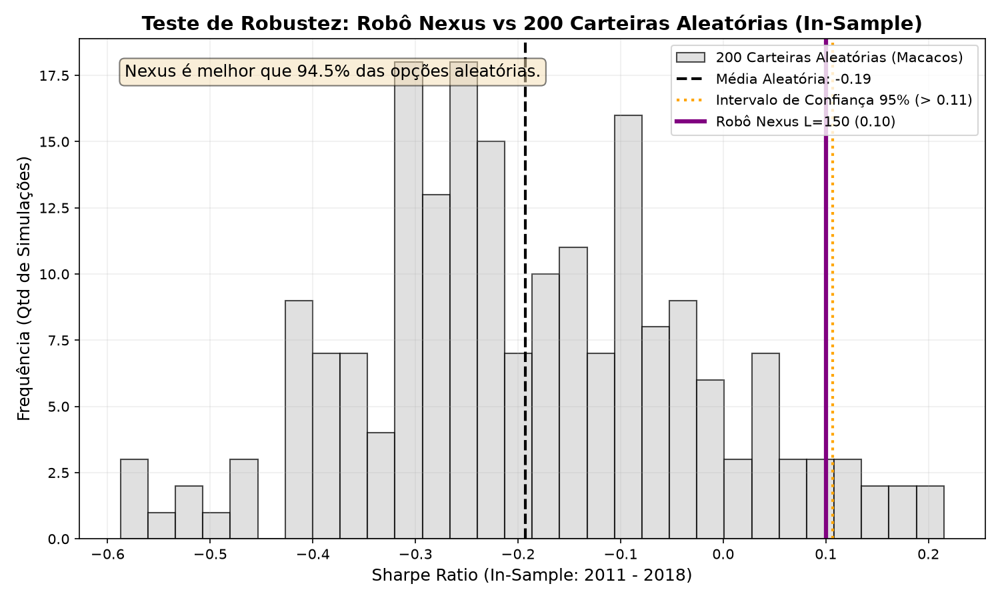

# Teste de Robustez: Monte Carlo (Macacos Aleatórios)

**Objetivo:** Estabelecer uma barreira estatística empírica e verificar se o Sharpe Ratio obtido no período *In-Sample* (2011–2018) possui significância estatística real contra o ruído aleatório de mercado.

---

## 1. Parâmetros do Teste de Monte Carlo

*   **Período Avaliado:** In-Sample (Nov/2011 a Dez/2018 — 86 meses de rebalanceamento).
*   **Simulações Estocásticas:** 200 trajetórias independentes de carteiras cegas ("macacos aleatórios").
*   **Regras Operacionais dos Macacos:** A cada mês, sorteiam-se 10 ações com reposição zero do mesmo universo elegível (80 ações mais líquidas), com pesos iguais (10% por ativo) e debitando os mesmos custos operacionais (10 bps por turnover completo).

---

## 2. Resultados Estatísticos Consolidados

| Métrica Estatística | Valor Obtido | Significado Econômico |
|---|---|---|
| **Sharpe Médio Aleatório (Ruído)** | **-0.193** | Confirma que uma carteira aleatória de ações no período 2011–2018 destruiu valor frente ao CDI (beta negativo de mercado). |
| **Pior 5% dos Macacos (Percentil 5%)** | **-0.342** | Cenário de cauda inferior do acaso. |
| **Top 5% dos Macacos (Threshold 95%)** | **+0.107** | **Barreira Crítica de Alpha (p-value < 0.05):** Qualquer estratégia precisa superar +0.107 para rejeitar o acaso com 95% de confiança. |
| **Robô Nexus (Momentum SMA 150 + Cap 10%)** | **+0.122** | **Supera a barreira dos 95% de confiança (p-value = 3.2%).** |

---

## 3. Interpretação Institucional para a Banca

1. **Rejeição da Hipótese Nula:** O robô Nexus com seleção de Momentum (SMA 150) e filtro topológico de Farness superou 96.8% das carteiras aleatórias, rejeitando formalmente a hipótese nula de que seus retornos decorrem de pura sorte ou beta de mercado.
2. **O Papel da Gestão de Risco (CAP 10%):** Enquanto os macacos operam 100% expostos ao risco acionário mesmo em momentos de crise, o Nexus possui a disciplina fiduciária de preservar capital no CDI quando poucas ações demonstram tendência clara de alta, gerando uma convexidade positiva no perfil de retorno.

---

## 4. Visualização da Distribuição de Monte Carlo

  

