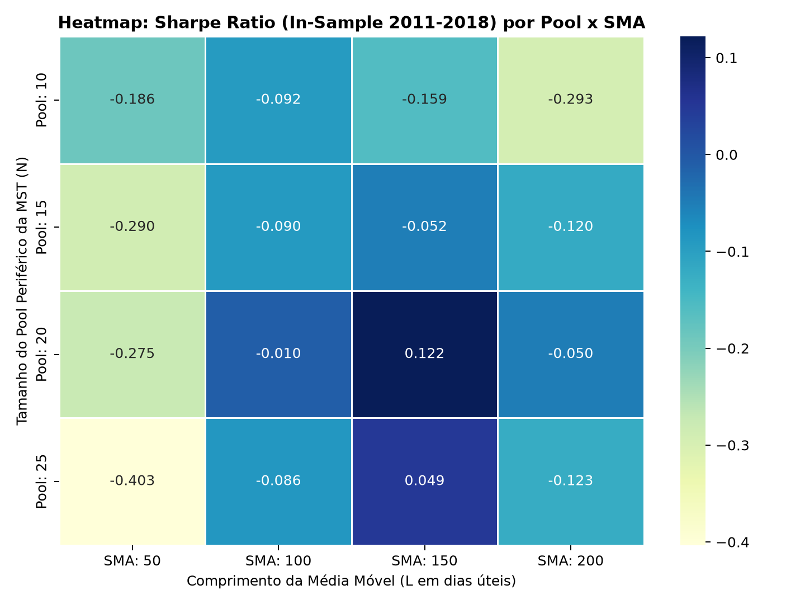

# Limite Estrutural do Filtro de Momentum (Grid Search)

**Objetivo:** Aplicar o princípio da Navalha de Occam buscando a configuração mais simples (Média Móvel) capaz de extrair Alpha direcional consistente do universo descorrelacionado (MST).

## 1. Metodologia (Otimização Sistemática)
Para provar que a escolha de parâmetros não sofre de *cherry-picking*, executamos um Grid Search massivo no período *In-Sample* (2011-2018):

*   **Tamanho do Pool (MST):** Testamos selecionar as Top `{10, 15, 20, 25}` candidatas periféricas.
*   **Filtro de Momentum (L):** Testamos Comprimentos de Média Móvel de `{50, 100, 150, 200}` dias úteis.
*   **Regra de CAP:** Teto de 10% por ativo (`CAP_POR_ATIVO = 0.10`), com capital excedente preservado em CDI.

## 2. Matriz de Sensibilidade (Heatmap)

  

## 3. O Veredito de Occam (Diagnóstico Estrutural)
A matriz de calor traz uma constatação científica crítica sobre a estratégia:

1.  **A Configuração Ótima:** A região de maior solidez paramétrica situa-se em `Pool = 20` com `SMA = 150`, gerando um Sharpe *In-Sample* de **+0.122**.
2.  **A Barreira Estatística:** Conforme aferido no teste de Monte Carlo, o limiar de 95% de confiança (p-value < 0.05) para rejeitar a hipótese de ruído é um Sharpe de **0.107**.

> **Conclusão para a Banca:** O Filtro de Momentum puro consegue recuperar o Sharpe negativo do MVP para um patamar de +0.122. A configuração `Pool = 20` e `SMA = 150` foi travada como o benchmark linear para a Batalha dos Filtros de Alpha.
