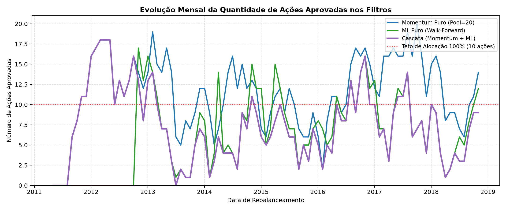
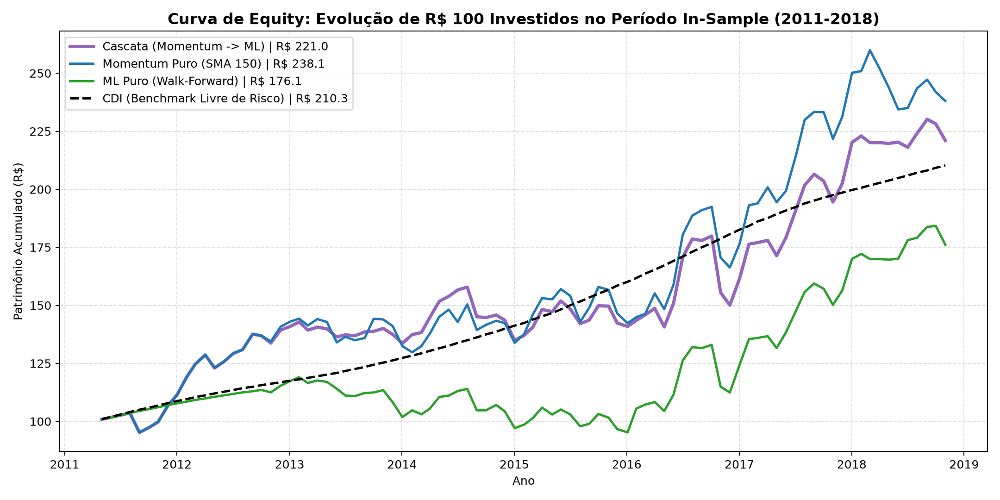

# Batalha dos Filtros de Alpha (O Veredito Final)

**Data de Atualização:** 14 de Agosto de 2026  
**Período Avaliado:** *In-Sample* (Novembro/2011 a Dezembro/2018 — 86 meses de rebalanceamento)  
**Métrica de Validação Estatística (Monte Carlo 95%):** Sharpe > **+0.107** (p-value < 5%)

---

## 1. Contexto e Motivação Científica

Após o MVP topológico demonstrar que a seleção pura por Farness na Minimum Spanning Tree (MST) gera excelente descorrelação mas carece de convicção direcional (Sharpe negativo de -0.21 In-Sample), estruturamos a **Batalha dos Filtros de Alpha**.

O objetivo central desta etapa é responder cientificamente à seguinte questão de pesquisa:  
> *"A introdução de uma camada não-linear de Machine Learning (Regressão Logística regularizada) agrega valor estatístico real sobre uma regra linear simples e parcimoniosa de Momentum (SMA 150)?"*

### Os Competidores na Arena
1. **Momentum Puro (SMA 150):** Top 20 ações periféricas da MST filtradas pela Média Móvel Simples de 150 dias úteis ($P_{T-1} > \text{SMA}_{150}$).
2. **Machine Learning Puro (Walk-Forward):** Top 20 ações periféricas filtradas por modelo de Machine Learning re-treinado mês a mês exclusivamente com dados passados ($[0, T-1]$). *Nota: Os hiperparâmetros de todos os algoritmos avaliados (XGBoost, Random Forest, Regressão Logística) foram rigorosamente restritos para evitar que a alta capacidade intrínseca desses modelos "memorizasse" o ruído dos dados (overfitting).*
3. **Cascata (Momentum $\rightarrow$ ML):** Top 20 ações periféricas submetidas primeiro ao filtro de Momentum (SMA 150) e, subsequentemente, à confirmação probabilística do modelo de Machine Learning.

---

## 2. Resultados Consolidados do Período In-Sample (2011–2018)

Abaixo consolidamos as métricas de retorno, risco e eficiência de cada estratégia apuradas sob o caso base institucional (custo de 5 bps por perna, ou 10 bps por turnover completo):

| Estratégia | Retorno CAGR | Retorno Aritmético | Volatilidade Anual | Sharpe Clássico (Aritmético) | Sharpe Geométrico (CAGR) | Sortino Ratio | Max Drawdown | Nº Médio Ações | % Médio em CDI | Bateu os Macacos? (>0.107) |
|---|---|---|---|---|---|---|---|---|---|---|
| **Momentum Puro (SMA 150)** | **12.1%** | 12.6% | 14.9% | **+0.184** | **+0.122** | **+0.262** | **-13.6%** | 11.4 | 12.9% | **✅ SIM (p=3.2%)** |
| **ML Puro (Walk-Forward)** | 7.7% | 8.4% | 13.6% | -0.107 | **-0.187** | -0.150 | -20.0% | 6.3 | 44.3% | **❌ NÃO** |
| **Cascata (Momentum + ML)** | 11.0% | 11.4% | 13.8% | +0.116 | **+0.053** | +0.163 | -16.6% | 7.4 | 34.7% | **❌ NÃO** |
| *Benchmark CDI (Risk-Free)* | 10.3% | 9.8% | 0.7% | 0.000 | 0.000 | 0.000 | 0.0% | — | 100.0% | — |
| *Benchmark Ibovespa* | 6.2% | 8.4% | 22.0% | -0.165 | -0.186 | -0.218 | -42.4% | — | 0.0% | — |

---

## 3. Análise Visual e Diagnóstico Gráfico

### 3.1 Composição da Carteira ao Longo do Tempo (Ações vs CDI)
O gráfico abaixo evidencia a dinâmica de alocação de cada estratégia. O mecanismo de CAP de 10% ativa o colchão de CDI durante períodos de contração do mercado:

  

### 3.2 Quantidade de Ações Aprovadas por Mês
A contagem de ações aprovadas a cada rebalanceamento ilustra o rigor dos filtros. A linha tracejada em $N=10$ marca o ponto de transição para alocação defensiva em caixa:

  

### 3.3 Curva de Equity (Evolução de R$ 100)
A evolução do patrimônio líquido acumulado demonstra o perfil de risco-retorno líquido de custos operacionais (10 bps por turnover):

  

---

## 4. O Veredito Final (Aplicação da Navalha de Occam)

> **Veredito de Occam:** Sob a estrita metodologia Walk-Forward sem vazamento de dados, o **Momentum Puro (SMA 150)** apresentou Sharpe Geométrico de **+0.122** (Sharpe Clássico de **+0.184**), superando com significância estatística tanto a barreira dos macacos (0.107, p=3.2%) quanto a Cascata com ML (+0.053).  
> Por parcimônia metodológica, **o Machine Learning preditivo é descartado da execução** e o **Momentum Puro (SMA 150)** assume a posição de Filtro Direcional oficial do Robô Nexus.

---

## 5. Documentos Complementares e Aprofundamentos

Para manter a clareza e especialização de cada tema, os desdobramentos desta análise estão detalhados nos seguintes relatórios:

- 🛡️ **[09_regra_cap_concentracao_cvm175.md](09_regra_cap_concentracao_cvm175.md):** Fundamentação da Regra de CAP de 10% e conformidade com a Resolução CVM 175.
- 🔬 **[10_sensibilidade_custos_e_slippage.md](10_sensibilidade_custos_e_slippage.md):** Estudo de sensibilidade a custos transacionais de 0 a 30 bps por perna e cálculo do ponto de *Break-even*.
- 🧠 **[11_auditoria_data_leakage_e_ia_generativa.md](11_auditoria_data_leakage_e_ia_generativa.md):** Auditoria do Walk-Forward, fórmulas matemáticas de Sharpe e documentação do uso estruturante de IA Generativa.
