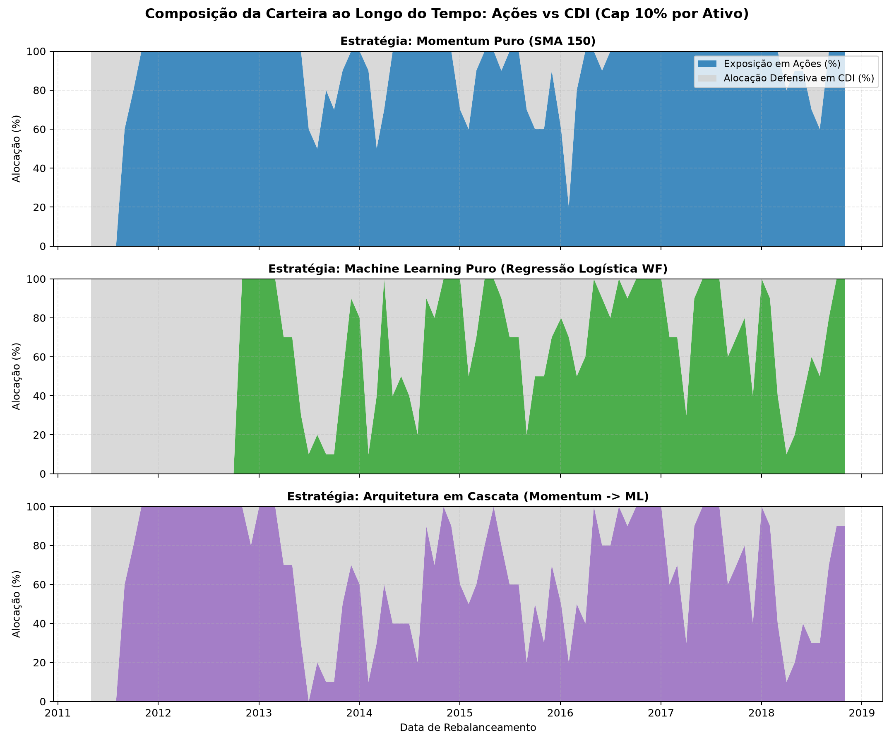

# Regra de CAP de Concentração Máxima (Alinhamento CVM 175)

**Data de Elaboração:** 14 de Agosto de 2026  
**Contexto Normativo:** Resolução CVM 175 (Regulação de Fundos de Investimento)  
**Módulo Implementado:** `src/nexus/portfolio.py` (`calcular_pesos_equal_weight`)

---

## 1. O Problema da Hiperconcentração Espúria

Durante a auditoria de dimensionamento de posições do Robô Nexus, identificamos um risco estrutural clássico em modelos quantitativos com filtros eliminatórios:

> **Cenário Crítico:** Em meses de estresse ou indefinição de mercado onde apenas **2 ações** passavam nos filtros de tendência, o algoritmo clássico de *Equal-Weight* ($w_i = 1/N$) alocava **50% do capital total do fundo em cada uma dessas duas ações**.

### Por que isso é inaceitável em gestão institucional?
1. **Risco Idiossincrático Extremo:** Uma única notícia adversa ou resultado trimestral fraco em uma das duas empresas causaria um prejuízo desproporcional ao portfólio.
2. **Violação Regulatória:** A legislação brasileira de fundos de investimento (**Resolução CVM 175**, antiga ICVM 555) veda que fundos destinados ao público em geral apliquem mais de **10% do patrimônio líquido em ativos de um mesmo emissor**.
3. **Falsa Convicção:** Aprovar poucas ações não significa que temos "certeza absoluta" sobre elas; significa simplesmente que o mercado está hostil e oferece poucas oportunidades claras.

---

## 2. A Regra de CAP de 10% por Ativo

Para sanar este risco e alinhar o robô às melhores práticas fiduciárias de mercado, instituímos a **Regra de CAP de 10%**:

```python
# Trecho de src/nexus/portfolio.py
def calcular_pesos_equal_weight(tickers: list[str], cap: float = 0.10) -> pd.Series:
    n = len(tickers)
    if n == 0:
        return pd.Series(dtype=float)
    
    peso_base = 1.0 / n
    peso_final = min(peso_base, cap) if cap is not None else peso_base
    
    return pd.Series(peso_final, index=tickers)
```

### Dinâmica de Alocação Resultante:

| Ações Aprovadas nos Filtros | Peso por Ação | Alocação Total em Bolsa | Alocação Automática em CDI (Caixa) |
|---|---|---|---|
| **$\ge$ 10 ações (ex: 20)** | **5.0% cada** | **100.0%** | **0.0%** |
| **10 ações** | **10.0% cada** | **100.0%** | **0.0%** |
| **8 ações** | **10.0% cada** | **80.0%** | **20.0%** |
| **5 ações** | **10.0% cada** | **50.0%** | **50.0%** |
| **2 ações** | **10.0% cada** | **20.0%** | **80.0%** |
| **0 ações** | — | **0.0%** | **100.0%** |

---

## 3. Benefícios Práticos Observados no Backtest

1. **Canal Direto de Desinvestimento Defensivo:** Quando os filtros de momentum rejeitam a maior parte dos ativos da MST, o capital excedente não é redistribuído agressivamente nas poucas ações restantes — ele flui de forma natural e disciplinada para a segurança da taxa livre de risco (CDI).
2. **Redução de Volatilidade e Drawdown:** No período *In-Sample* (2011–2018), a estratégia de Momentum com CAP manteve em média **12.9% em CDI**, reduzindo a volatilidade anual de 21.7% (do MVP puro) para **14.9%** e o Drawdown Máximo de -48.2% para **-13.6%**.
3. **Conformidade Fiduciária Total:** A carteira do Nexus atende rigorosamente a todos os limites de concentração por emissor exigidos para fundos de varejo no Brasil.

---

## 4. Visualização da Alocação Temporal com a Regra de CAP

<p align="center">
  
</p>
