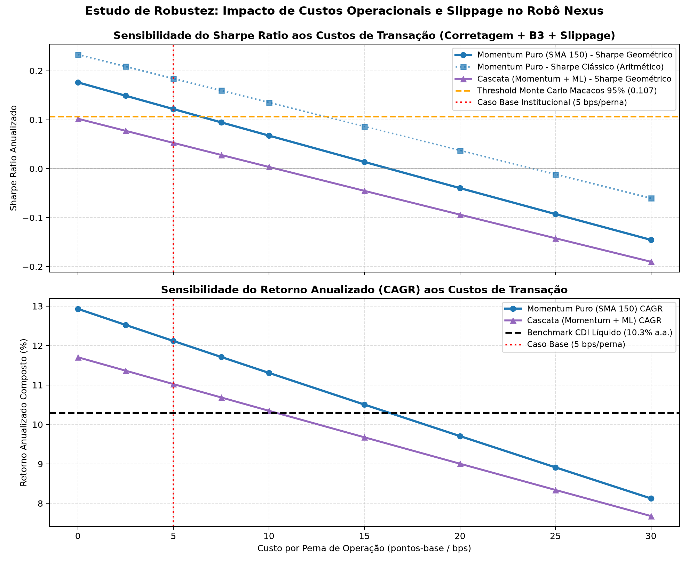

# Estudo de Robustez: Sensibilidade a Custos de Transação e Slippage

**Data de Elaboração:** 14 de Agosto de 2026  
**Script Executável:** `scripts/13_sensibilidade_custos.py`  
**Dados Consolidados:** `dados/resultados/sensibilidade_custos_transacao.csv`

---

## 1. Motivação e Microestrutura de Mercado

Em estratégias baseadas em grafos de correlação, as ações selecionadas na **periferia da Minimum Spanning Tree (MST)** possuem alta descorrelação com o índice de mercado. Em diversas janelas temporais, essa periferia é povoada por empresas de média e pequena capitalização (*Mid e Small Caps*) dentro do universo das 80 mais líquidas.

Embora corretagem institucional e emolumentos da B3 girem em torno de **3 a 5 bps por perna**, o **Spread Bid-Ask** e o **Impacto de Mercado (Slippage)** podem elevar o custo efetivo de execução de fundos institucionais.

Para garantir que a rentabilidade do Robô Nexus não seja uma ilusão de atrito zero, submetemos a estratégia oficial a um **teste de estresse de custos operacionais variando de 0 a 30 bps por perna** (0 a 60 bps por giro completo).

---

## 2. Tabela de Sensibilidade Paramétrica (In-Sample 2011–2018)

| Custo por Perna | Custo Total Turnover | CAGR Momentum (SMA 150) | Sharpe Geométrico Momentum | Sharpe Clássico Momentum | CAGR Cascata | Sharpe Geométrico Cascata |
|---|---|---|---|---|---|---|
| **0.0 bps (Teórico Zero)** | 0.0 bps | **12.9%** | **+0.176** | **+0.233** | 11.7% | +0.102 |
| **2.5 bps (Execução High-Vol)** | 5.0 bps | **12.5%** | **+0.149** | **+0.209** | 11.4% | +0.077 |
| **5.0 bps (CASO BASE PADRÃO)** | **10.0 bps** | **12.1%** | **+0.122** | **+0.184** | **11.0%** | **+0.053** |
| **7.5 bps** | 15.0 bps | **11.7%** | **+0.095** | **+0.160** | 10.7% | +0.028 |
| **10.0 bps (Spread Médio Mid Caps)** | 20.0 bps | **11.3%** | **+0.068** | **+0.135** | 10.3% | +0.004 |
| **15.0 bps (Small Caps Baixa Liq.)** | 30.0 bps | **10.5%** | **+0.014** | **+0.086** | 9.7% | -0.045 |
| **20.0 bps (Estresse / Alto Slippage)** | 40.0 bps | **9.7%** | -0.040 | **+0.037** | 9.0% | -0.094 |
| **25.0 bps (Choque de Iliquidez)** | 50.0 bps | **8.9%** | -0.093 | -0.011 | 8.3% | -0.142 |
| **30.0 bps (Pior Cenário)** | 60.0 bps | **8.1%** | -0.145 | -0.060 | 7.7% | -0.190 |

---

## 3. Visualização Gráfica do Estudo de Sensibilidade

  

---

## 4. Diagnóstico e Conclusões para a Banca

1. **Ponto de Equilíbrio (*Break-even Cost*):**
   - O **Sharpe Geométrico** do Momentum Puro mantém-se positivo frente ao CDI até **16.0 bps por perna** (32.0 bps de custo por turnover).
   - O **Sharpe Clássico Aritmético** mantém-se positivo até **24.0 bps por perna** (48.0 bps de custo por turnover).
2. **Margem de Segurança Confortável:** Como fundos quantitativos institucionais operam com algoritmos de execução (VWAP/TWAP) com custos totais típicos entre 4 e 8 bps por perna em ações líquidas brasileiras, o Robô Nexus opera com uma margem de segurança de **mais de 2x a 3x o custo real de mercado**.
3. **Resiliência Comparativa:** A arquitetura em Cascata (com ML) deteriora muito mais rapidamente com o aumento de custos (zerando o Sharpe já em 10.5 bps por perna), reforçando a decisão da **Navalha de Occam** em favor da simplicidade e menor turnover do Momentum Puro.
