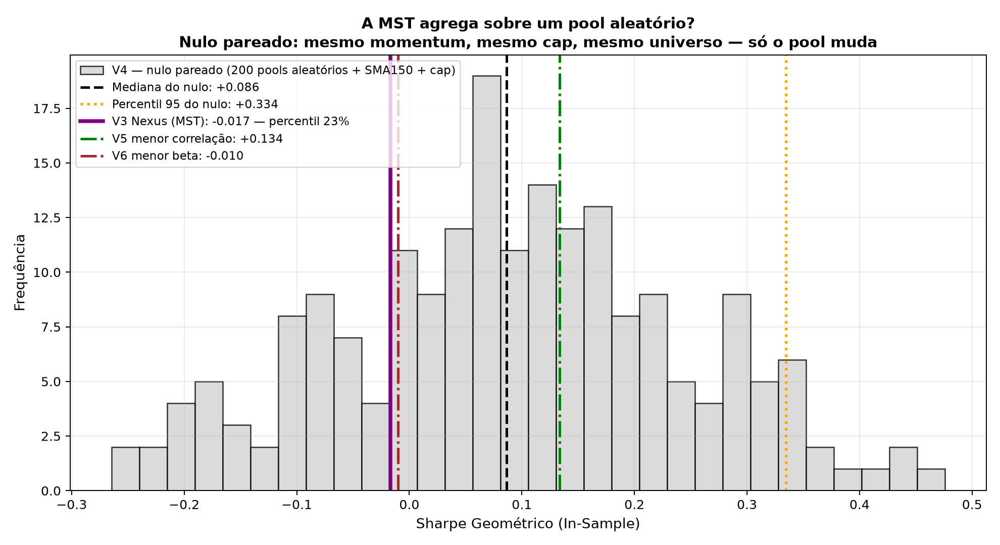
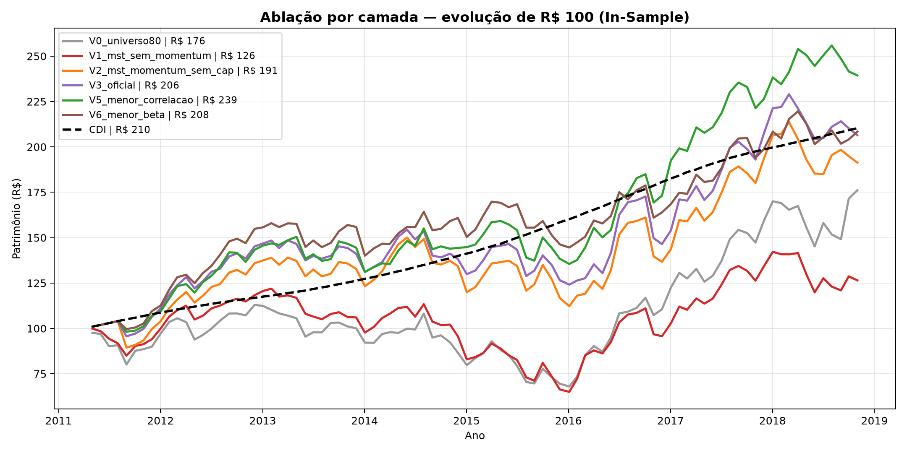

# Ablação e Atribuição por Camada (TICKET-C03)

**Script:** `scripts/14_ablacao_atribuicao.py`
**Período:** In-Sample — May/2011 a Nov/2018 (91 meses)
**Parâmetros travados:** Pool = 20, SMA = 150, Cap = 10%, custo = 5.0 bps/perna

---

## 1. A pergunta

O Sharpe de +0.122 publicado pelo projeto foi produzido por três camadas
introduzidas simultaneamente: seleção topológica (MST), filtro direcional
(momentum) e colchão de caixa (cap de 10%). **Nenhum teste anterior separou as
três.** O teste de Monte Carlo original compara a combinação inteira contra
carteiras aleatórias 100% investidas, e atribui toda a diferença à MST.

Este documento isola cada camada mantendo as demais constantes.

## 2. Resultados das variantes

| Variante | Composição | CAGR | Vol. | Sharpe Geom. | Sharpe Clás. | MDD | Nº médio ações | % médio CDI | Turnover |
|---|---|---|---|---|---|---|---|---|---|
| **V0** | Universo 80, equal-weight, sem filtros | 7.8% | 20.8% | **-0.122** | -0.011 | -39.8% | 80.0 | 0.0% | 2.4% |
| **V1** | MST top-20, sem momentum, cap 10% | 3.1% | 19.7% | **-0.364** | -0.246 | -46.6% | 20.0 | -0.0% | 58.8% |
| **V2** | MST top-20 + SMA150, **sem** cap (100% investido) | 8.9% | 17.6% | **-0.078** | +0.016 | -25.2% | 11.3 | 4.4% | 63.3% |
| **V3** | MST top-20 + SMA150 + cap 10% — **oficial** | 10.0% | 15.8% | **-0.017** | +0.063 | -19.6% | 11.3 | 13.4% | 55.9% |
| **V5** | Menor correlação média + SMA150 + cap 10% | 12.2% | 14.2% | **+0.134** | +0.191 | -14.8% | 11.3 | 11.0% | 36.4% |
| **V6** | Menor \|beta\| vs. IBOV + SMA150 + cap 10% | 10.2% | 12.9% | **-0.010** | +0.055 | -14.9% | 12.3 | 8.1% | 34.6% |

### V4 — Nulo pareado (200 sorteios)

Pool de 20 ações **sorteadas** do mesmo universo elegível, submetidas ao
**mesmo** filtro de momentum (SMA 150) e ao **mesmo** cap de 10%.
Difere do V3 em exatamente uma coisa: a origem do pool.

| Estatística | Sharpe Geométrico |
|---|---|
| Mediana do nulo | +0.086 |
| Percentil 95 do nulo | +0.334 |
| **V3 (MST)** | **-0.017** |
| **Percentil do V3 no nulo** | **23.0%** |
| **p-value (unilateral)** | **77.0%** |

## 3. As três leituras

| Comparação | Diferença de Sharpe | Interpretação |
|---|---|---|
| **V3 − V4 (mediana)** | **-0.103** | contribuição da **seleção topológica** |
| **V3 − V2** | **+0.061** | contribuição do **colchão de caixa** (cap) |
| **V3 − V1** | **+0.347** | contribuição do **filtro de momentum** |

A camada que mais contribuiu foi: **momentum** (+0.347).

### Controles sem grafo (plano-mestre, Parte 2.5.4)

| Controle | Sharpe | vs. V3 |
|---|---|---|
| V5 — menor correlação média | +0.134 | -0.151 |
| V6 — menor \|beta\| vs. IBOV | -0.010 | -0.007 |

Se um destes empata com o V3, a MST está reproduzindo um critério que se obtém
sem teoria de grafos — e a contribuição do grafo passa a ser interpretabilidade e
visualização, não alpha. O plano-mestre já registra essa possibilidade como
conclusão legítima.

## 4. Veredito

> A seleção topológica **não agrega** sobre um pool aleatório. O V3 caiu no percentil 23.0% do nulo pareado — dentro do que se obtém sorteando 20 ações do mesmo universo e aplicando os mesmos filtros. O Sharpe do Robô Nexus vem do momentum e do colchão de caixa, **não da posição das ações na MST**. Este é um resultado negativo legítimo e deve ser reportado como tal.

## 5. Visualizações

### 5.1 Distribuição do nulo pareado

  

### 5.2 Curvas de equity por variante

  

---

*Todos os números deste documento são gerados por `scripts/14_ablacao_atribuicao.py`.
Nenhum valor foi escrito à mão.*
