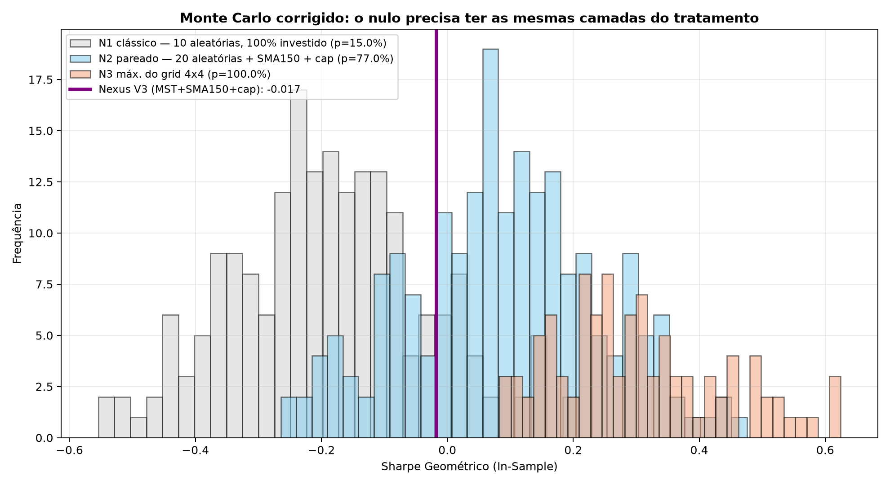

# Teste de Monte Carlo Corrigido (TICKET-C02)

**Script:** `scripts/15_monte_carlo_corrigido.py`
**Período:** In-Sample — May/2011 a Nov/2018 (91 meses)
**Substitui:** `docs/06_teste_monte_carlo_baselines.md`

---

## 1. Por que o teste anterior precisou ser refeito

| Defeito | Evidência |
|---|---|
| Números não calculados | `09_baseline_aleatorias.py:117` fixa `SHARPE_NEXUS = 0.10`; as linhas 178-179 publicam `0.122` e `3.2%` como strings literais |
| Figura contradiz o texto | `images/02_baseline_macacos_in_sample.png` marca a linha em 0.10; a tabela afirma 0.122 |
| Nulo sem as camadas do tratamento | Macacos 100% investidos vs. Nexus com ~13% em CDI, num período em que o CDI (10,3% a.a.) superou o Ibovespa (6,2% a.a.) |
| Multiple testing ignorado | O par vencedor é o máximo de 16 combinações, comparado ao p95 de um sorteio único |

## 2. Os três nulos

| Nulo | Composição | Pergunta |
|---|---|---|
| **N1 — clássico** | 10 ações aleatórias, 100% investido, sem momentum | O mercado aleatório bate o CDI? |
| **N2 — pareado** | 20 ações aleatórias + SMA 150 + cap 10% | A MST agrega sobre um pool qualquer? |
| **N3 — máximo do grid** | N2, mas cada trajetória varre 4×4 combinações e reporta seu máximo | A vantagem sobrevive à busca em grid? |

## 3. Resultados

**Sharpe geométrico da variante oficial (recalculado): `-0.0169`**

| Nulo | Mediana | Percentil 95 | p-value vs. Nexus |
|---|---|---|---|
| N1 — clássico | -0.187 | +0.101 | **15.0%** |
| N2 — pareado | +0.086 | +0.334 | **77.0%** |
| N3 — máximo do grid | +0.284 | +0.544 | **100.0%** |

Trajetórias: 200 (N1, N2), 100 (N3).

## 4. Veredito

> O Sharpe de -0.017 **não** supera o nulo pareado (p=77.0%). Sortear 20 ações do mesmo universo e aplicar os mesmos filtros produz resultado equivalente. A afirmação de significância estatística publicada em `docs/06` não se sustenta quando o nulo recebe as mesmas camadas do tratamento.

## 5. Visualização

  

---

## 6. Nota metodológica

O nulo N1 responde a uma pergunta legítima mas fácil: *"o mercado acionário
brasileiro de 2011-2018 bateu o CDI?"* — a resposta é não, e qualquer estratégia
que passe parte do tempo em caixa vence esse nulo sem precisar de sinal algum.

O nulo N2 é o que sustenta a tese do projeto, porque difere do tratamento em
exatamente uma dimensão: a origem do pool. O nulo N3 corrige o fato de que o par
(Pool, SMA) não foi escolhido a priori, e sim como máximo de um grid.

*Todos os números deste documento são gerados pelo script. Nenhum valor foi escrito à mão.*
