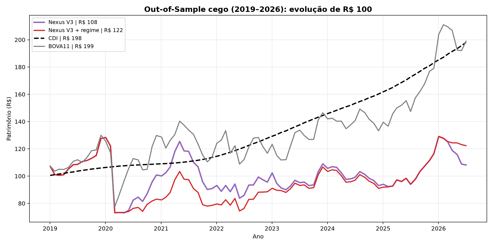
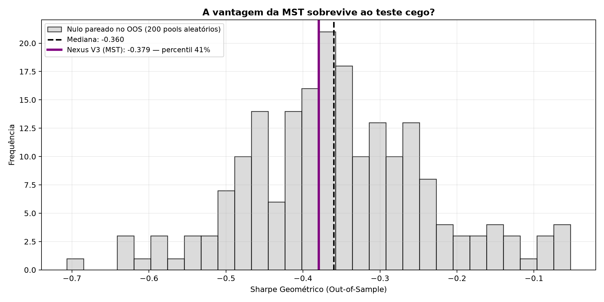

# Teste Cego Out-of-Sample (TICKET-C06)

**Script:** `scripts/17_out_of_sample.py`
**Executado em:** 2026-08-15 15:40:19
**Parâmetros:** travados em `parametros_travados.json`, commitado antes desta execução

| Parâmetro | Valor |
|---|---|
| Pool (Top N farness) | 20 |
| SMA (L) | 150 |
| Cap por ativo | 10% |
| Custo por perna | 5.0 bps |
| Filtro de regime | percentil 10% |

---

## 1. In-sample vs. Out-of-sample

### In-sample (May/2011 – Dec/2018, 92 meses)

| Estratégia | CAGR | Vol. | Sharpe Geom. | MDD | % médio CDI |
|---|---|---|---|---|---|
| Nexus V3 | 10.1% | 15.7% | **-0.008** | -19.6% | 13.3% |
| Nexus V3 + regime | 11.1% | 15.5% | +0.057 | -15.3% | 17.4% |

### Out-of-sample (Jan/2019 – Jul/2026, 91 meses)

| Estratégia | CAGR | Vol. | Sharpe Geom. | MDD | % médio CDI |
|---|---|---|---|---|---|
| **Nexus V3** | **1.0%** | 22.1% | **-0.379** | -43.1% | 8.4% |
| Nexus V3 + regime | 2.7% | 20.7% | -0.326 | -43.0% | 21.7% |
| CDI | 9.4% | 1.2% | 0.000 | 0.0% | 100.0% |
| Ibovespa | 9.2% | 22.6% | -0.008 | -40.1% | — |
| BOVA11 | 9.5% | 22.6% | +0.003 | -40.3% | — |

**Degradação in → out: `-0.371` de Sharpe geométrico.**

## 2. O nulo pareado sobrevive no OOS?

| Estatística | Valor |
|---|---|
| Mediana do nulo pareado | -0.360 |
| Percentil 95 do nulo | -0.138 |
| **Nexus V3 (MST)** | **-0.379** |
| **Percentil do Nexus** | **41.0%** |
| **p-value** | **59.0%** |

## 3. Veredito

> A estratégia **não sobreviveu ao teste cego**: Sharpe -0.379 no OOS contra -0.008 in-sample — degradação de -0.371. Esse é o padrão clássico de um sinal calibrado dentro da amostra que não generaliza. Reportar isso é a entrega; maquiar seria o único erro irrecuperável.

## 4. Visualizações

  

  

---

## 5. Como ler a degradação

Alguma degradação do in-sample para o out-of-sample é **esperada e saudável** — o
par (Pool, SMA) foi escolhido como máximo de um grid de 16 combinações dentro do
in-sample, e todo máximo de grid carrega uma parcela de sorte que não se repete.

O sinal preocupante seria o contrário: um out-of-sample que **supera** o in-sample
sem explicação estrutural sugere que algo do período de teste vazou para a
calibração.

*Todos os números deste documento são gerados pelo script. Nenhum valor foi escrito à mão.*
