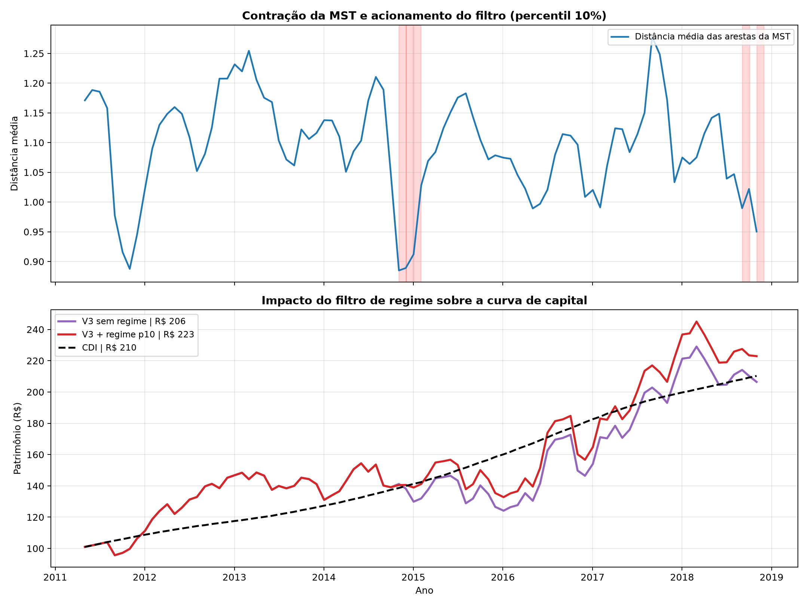

# Filtro de Regime Topológico (TICKET-C05)

**Script:** `scripts/16_calibracao_regime.py`
**Módulo:** `src/nexus/regime.py`
**Período:** In-Sample — May/2011 a Nov/2018 (91 meses)

---

## 1. A camada que faltava

O Filtro de Regime era anunciado em todos os documentos do projeto como a terceira
camada da arquitetura, mas **não existia no código**. Este documento registra sua
implementação, calibração e — o mais importante — o teste de se ele agrega algo
sobre as camadas que já estavam lá.

**Métrica:** distância média das arestas da MST. Quando o mercado entra em pânico,
as correlações sobem, as distâncias de Mantegna encolhem e a árvore se contrai
(Onnela et al., 2003). Nos dados do projeto, a correlação média sai de 0,10–0,22
em períodos normais.

**Regra (um único parâmetro):**

```
limiar(T) = percentil p da distância média observada estritamente até T-1
se dist(T) < limiar(T)  ->  exposição em ações = 30%
senão                    ->  exposição = 100% do que o cap determinou
```

O percentil é **expansível**, nunca calculado sobre a série inteira: em 2011 o
modelo usa apenas o que existia em 2011. Enquanto houver menos de 24
meses de histórico, o filtro se abstém.

## 2. Calibração — todos os percentis testados

| Percentil | Meses acionado | CAGR | Vol. | Sharpe (com cap) | MDD | Sharpe (sem cap) |
|---|---|---|---|---|---|---|
| **5%** | 2/91 (2.2%) | 10.3% | 15.8% | -0.002 | -18.3% | -0.064 |
| **10%** ⬅ **travado** | 5/91 (5.5%) | 11.2% | 15.5% | +0.055 | -15.3% | +0.016 |
| **15%** | 14/91 (15.4%) | 8.0% | 13.7% | -0.171 | -15.3% | -0.196 |
| **20%** | 19/91 (20.9%) | 7.5% | 13.4% | -0.207 | -15.3% | -0.230 |

**Linha de base sem regime:** V3 (com cap) Sharpe -0.017,
MDD -19.6% | V2 (sem cap) Sharpe -0.078,
MDD -25.2%.

## 3. Teste de redundância com o cap de 10%

| Configuração | Sharpe | MDD | % médio em CDI |
|---|---|---|---|
| V3 (cap, sem regime) | -0.017 | -19.6% | 13.4% |
| V3 + regime p10 | +0.055 | -15.3% | 16.9% |
| V2 (sem cap, sem regime) | -0.078 | -25.2% | 4.4% |
| V2 + regime p10 | +0.016 | -18.3% | 8.2% |

> **O filtro de regime agrega sobre o cap.** No percentil 10%, o Sharpe varia +0.072 e o drawdown máximo varia +4.4 p.p. em relação ao V3 sem regime. Sobre a base sem cap (V2), o efeito isolado é de +0.093.

## 4. Atraso estrutural de reação

A distância média vem de uma janela trailing de 63 pregões e
é avaliada **uma vez por mês**. Num crash que se desenvolve em dias, o filtro reage
depois do estrago. Isto não é ajustável — é uma propriedade do desenho, e precisa
ser declarada em vez de escondida.

| Crise (in-sample) | Mês do choque | Mês da reação | Atraso (meses) |
|---|---|---|---|
| Crise do euro / downgrade (2011-2012) | 2011-09 | não acionou | — |
| Colapso de commodities (2014-2015) | 2015-08 | 2014-11 | -9 |
| Joesley Day (2017) | 2017-05 | não acionou | — |
| Greve dos caminhoneiros (2018) | 2018-06 | 2018-09 | 3 |

## 5. Visualização

<p align="center">
  
</p>

---

## 6. Enquadramento honesto

O filtro de regime é **instrumento de risco, não de alpha**. Julgá-lo pelo Sharpe é
usar a métrica errada: ele pode legitimamente não melhorar o retorno e ainda assim
ser um sucesso se cortar o drawdown. A tabela da seção 3 reporta as duas dimensões
justamente por isso.

*Todos os números deste documento são gerados pelo script. Nenhum valor foi escrito à mão.*
